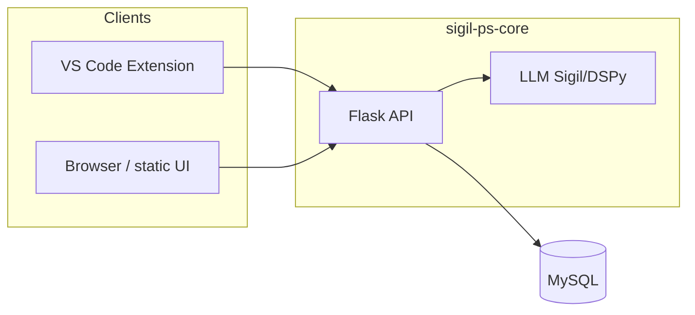

# SIGIL-PS Core

This is the repository for the backend component of the conversational agent **SIGIL-PS** (or just Sigil), developed by NAU's RESHAPE Lab. It provides the API, LLM (Sigil/DSPy), and optional web UI that the VS Code extension and other clients use.

## Project overview

Sigil is a conversational agent for novice programming students. This **core** repo contains:

- **API** – Flask REST API for chat, feedback, personalization, personas, and users
- **LLM** – DSPy-based Sigil module for tutoring responses
- **UI** – React (Vite) chat interface, served by the API or embedded in the VS Code extension

## Architecture



- **Flask API** handles HTTP requests, manages sessions, and calls the LLM.
- **Sigil (DSPy)** produces tutoring responses; personas and personalization are applied here.
- **MySQL** stores users, personalization, personas, and related data.
- The React app in `ui/` is built to `ui/dist` and served by Flask at `/` in production.

## Prerequisites

- **Docker** (recommended for local run), or
- **Python 3.10+** and **MySQL** (or Docker for DB only) if running the API locally
- **Node.js** and **pnpm** (or npm) if you need to build or develop the UI

## Environment

Copy `api/.env.template` to `api/.env` and set:

| Variable | Description |
|----------|-------------|
| `OPENAI_API_KEY` | Required for the LLM (DSPy/OpenAI). Also needed for evaluation. |
| `MYSQL_HOST` | MySQL host (e.g. `localhost` or `db` when using Docker Compose). |
| `MYSQL_DATABASE` | Database name (e.g. `sigil_db`). |
| `MYSQL_USER` | MySQL user. |
| `MYSQL_PASSWORD` | MySQL password. |
| `MYSQL_ROOT_PASSWORD` | Optional; used by some DB setup flows. |

**Note:** When using Docker Compose, the Compose file overrides DB-related env for the API container (local/test only; do not use this setup for production).

## Running

### Docker (recommended for local/test)

From the **root of this repo** (sigil-ps-core):

```bash
docker-compose up --build
```

The API is available at **http://localhost:80**. The Compose setup is for **local testing only**; do not use it for production deployment.

### Local API (without Docker)

1. Ensure MySQL is running and the database exists (e.g. create `sigil_db`).
2. Copy `api/.env.template` to `api/.env` and set `MYSQL_HOST`, `MYSQL_USER`, `MYSQL_PASSWORD`, and `OPENAI_API_KEY`.
3. From the repo root:

   ```bash
   pip install -r requirements.txt
   set FLASK_APP=api.main
   flask run --host=0.0.0.0 --port=5000
   ```

   (On Unix/macOS use `export FLASK_APP=api.main`.)

The API runs on port 5000. For production-style serving (e.g. Gunicorn), see your deployment docs.

### UI

- **Production:** The Flask app serves the built UI from `ui/dist` at `/`. Build the UI from the `ui/` directory: `pnpm install && pnpm run build` (see [ui/README.md](ui/README.md)).
- **Development:** Run the UI dev server from `ui/`: `pnpm install && pnpm run dev` (e.g. http://localhost:5173). Point the UI at your local API if needed via its env (see `ui/.env.template`).

## Testing and evaluation

### CLI chat (interactive)

Use [test/cl_chat.py](test/cl_chat.py) to exercise Sigil locally with optional code, history, and feedback (no API or DB required). From the repo root, with `OPENAI_API_KEY` set:

```bash
python test/cl_chat.py
```

### LLM evaluation

The evaluation pipeline scores model outputs with configurable datasets and metrics (DeepEval/GEval). Full details: [docs/evaluation.md](docs/evaluation.md).

From the `test/` directory, with `OPENAI_API_KEY` set:

```bash
cd test
python evaluation.py tests/example_test.json results/my_output.json
```

Paths in the test config JSON are relative to the current working directory; running from `test/` is recommended.

### API / unit tests

There are no pytest (or other) API unit tests in this repo at present. The primary automated check is the **evaluation** flow above. To add API tests, use a standard Python test runner (e.g. pytest) against the Flask app.

## Project layout

| Path | Description |
|------|-------------|
| `api/` | Flask app, routes (prompt, feedback, personalization, personas, users), DB config and utilities. |
| `llm/` | DSPy Sigil module and personas. |
| `test/` | CLI chat script, evaluation script, dataset/metric definitions, and test configs. |
| `ui/` | React (Vite) chat UI; built output is served by the API. |
| `docs/` | Documentation (e.g. evaluation). |

## Links

- **VS Code extension:** See the [sigil-ps-vscode](../sigil-ps-vscode) sibling repo for the extension that talks to this API.
- **Evaluation:** [docs/evaluation.md](docs/evaluation.md) for dataset format, metrics, and running evaluation.
