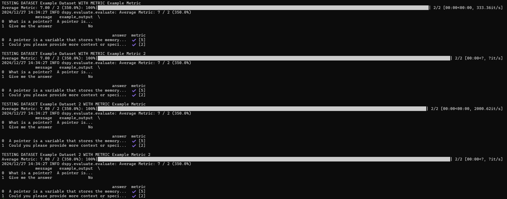

# SIGIL-PS Evaluation

We have built our own evaluation module for Sigil. It allows one to define reusable datasets and metrics in JSON files, and then define tests to run composed of datasets and metrics. The implementation uses **DeepEval** (GEval) and an LLM to score chatbot responses.

## Definitions

**Dataset** – A JSON file containing a set of data points. Each point has an `input` (student message), optional `code`, an expected/gold `output`, and an `actual_output` (model response to be scored). Datasets used by this script are typically **result** datasets: they already contain `actual_output` from a prior run or export (e.g. from the API or a batch job).

**Metric** – A JSON file defining how to score a response (e.g. correctness, tutor similarity). Metrics are driven by a `metric_description` and optional `score` metadata. The evaluator uses DeepEval’s GEval and an LLM to produce scores.

**Test config** – A JSON file that points to **one** dataset file and **one or more** metric files. The program evaluates every data point in that dataset with each metric and writes aggregated results to an output file.

## Run command

From the **`test/`** directory (paths in the test config are relative to the current working directory):

```bash
cd test
python evaluation.py <test_config.json> <output.json>
```

- **test_config.json** – Path to the test config file (see below).
- **output.json** – Path where the script will write the evaluation results (per-item scores and overall metric averages).

You must set **`OPENAI_API_KEY`** in your environment; the evaluator LLM (GEval) uses it.

## Test config JSON

The test config file has two fields:

| Field     | Type   | Description |
|-----------|--------|-------------|
| `datasets`| string | **Single** path to the dataset JSON file (e.g. `test_cases/cs1qa_small_results_v1-0.json`). |
| `metrics` | array  | Array of paths to metric JSON files (e.g. `["metrics/similarity.json"]`). |

Example ([test/tests/example_test.json](../test/tests/example_test.json)):

```json
{
    "metrics": ["metrics/similarity.json"],
    "datasets": "test_cases/cs1qa_small_results_v1-0.json"
}
```

Paths are relative to the directory from which you run `evaluation.py`; running from `test/` is recommended.

## Dataset format

The dataset file must match what [evaluation.py](../test/evaluation.py) and [dataset_util.py](../test/dataset_util.py) expect.

### Top-level fields

- `name` – Descriptive name for the dataset.
- `config` – Optional metadata (e.g. `example_outputs: true`).
- `data` – Array of data points (see below).

### Data point fields

Each item in `data` must include:

| Field           | Description |
|-----------------|-------------|
| `input`         | Student message (prompt). |
| `output`        | Expected/gold response (used as reference by the metric). |
| `actual_output` | Model response to be scored (must already be filled). |
| `code`          | Optional; student code context if the metric uses it. |

These datasets are usually **result** datasets: `actual_output` is already populated by a previous pipeline (e.g. running the model on `input`/`code` and saving the reply). The evaluation script does **not** call the Sigil model; it only runs the metrics on existing `actual_output` values.

Example data point:

```json
{
    "input": "What is a pointer?",
    "output": "A pointer is a variable that holds a memory address.",
    "actual_output": "A pointer is a variable that stores the address of another variable...",
    "code": ""
}
```

## Creating metrics

### Example metric JSON

```json
{
    "name": "Tutor Similarity",
    "config": {
        "needs_history": true,
        "needs_example_output": true
    },
    "metric_description": "How well the chatbot responds compared to the example tutor response. Consider correctness, tone, and depth.",
    "score": {
        "type": "scale",
        "description": "1 = poor, 5 = excellent",
        "min": 1,
        "max": 5
    }
}
```

### Fields

- `name` – Descriptive name for the metric.
- `config` – Optional metadata (`needs_history`, `needs_example_output`, etc.).
- `metric_description` – Description used by the evaluator LLM; be specific so scores are consistent.
- `score` – Optional; defines score type:
  - `"scale"` – Integer scale; include `min` and `max`.
  - `"boolean"` – True/false.
  - `"percentage"` – Float 0–100.

The implementation uses **DeepEval’s GEval**; `OPENAI_API_KEY` is required.

## End-to-end example

1. Ensure you have a **result** dataset (with `input`, `output`, `actual_output`, and optionally `code` for each item). For example, `test/test_cases/cs1qa_small_results_v1-0.json`.
2. Ensure you have at least one metric file, e.g. `test/metrics/similarity.json`.
3. Create a test config, e.g. `test/tests/my_test.json`:

   ```json
   {
       "datasets": "test_cases/cs1qa_small_results_v1-0.json",
       "metrics": ["metrics/similarity.json"]
   }
   ```

4. From the repo root, set `OPENAI_API_KEY` and run:

   ```bash
   cd sigil-ps-core/test
   python evaluation.py tests/my_test.json results/my_output.json
   ```

5. Open `results/my_output.json` for per-item scores and overall metric averages.

## Troubleshooting

- **Missing keys:** If you see `KeyError` or similar, check that every data point has `input`, `output`, and `actual_output`; the test config has `datasets` (string) and `metrics` (array).
- **Path errors:** All paths in the test config are relative to the **current working directory**. Run from `test/` and use paths like `test_cases/...` and `metrics/...`.
- **API key:** Ensure `OPENAI_API_KEY` is set in the environment where you run `evaluation.py`; the GEval model needs it.

The output structure is similar to:


